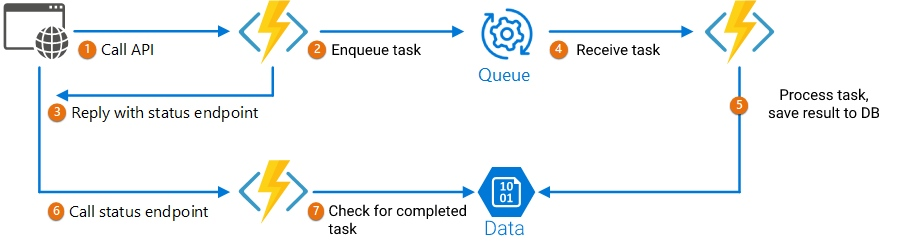

# Advanced

This collection of endpoints will let you to get more results from the content ranking in Google Search or Google News.

**Turnaround time:** up to 1 minute

These endpoints follow the Asynchronous Request-Reply Pattern:

<figure><figcaption></figcaption></figure>



Price: **2 API units**

****



`Token Your.API.Key`



A list of keywords you want to analyze. Maximum length is 

`3`

 .



2-letters country code.

Default `us`.



2-letters language code.

Default `en`.



`google-search`

 (default) or 

`google-news`



```json
{
    "message": "Task created",
    "id": "3c0a7f54-73da-40f2-b7ed-f39d939424f8",
    "created": "2023-01-12T09:50:31.441600+00:00"
}
```




```json
{
    "error": "Missing data in payload. This endpoint requires an array of keywords, a country (string, 2-digit country code) and a language (string, 2-digit language code)."
}
```




```javascript
{
    "error": "Your account is not enabled to perform this action, please contact us."
}
```



```javascript
{
  "error": "Insufficient API units"
}
```





Price: 

**free**



`Token Your.API.Key`



If the status is `loading`

```javascript
{
    "id": "3c0a7f54-73da-40f2-b7ed-f39d939424f8",
    "created": "2023-01-12T09:50:31.441600+00:00",
    "keywords": ["keyword1", "keyword2"],
    "status": "loading",
    "data": {}
}
```

If the status is `completed`


```javascript
{
    "id": "3c0a7f54-73da-40f2-b7ed-f39d939424f8",
    "created": "2023-01-12T09:50:31.441600+00:00",
    "keywords": ["keyword1", "keyword2"],
    "status": "completed",
    "data": {
        // Common topics found in search results
        "topics": ["topic1", "topic2"],
        // Questions
        "questions": {
            //From Quora
            "quora": [
                  {"source": 'https://www.quora.com/...",
                   "question": "Question...",
                   "wordcount": 81},
                   ...
                ],
            // From Google Autocomplete and People Also Ask box
            "google_suggest": [
                {"source": "Google Autocomplete",
                "question": "Question2..."},
                ...
                ],
            // Extracted from search results
            "content": [
                {"header": "Question",
                 "domain": "example.com",
                 "title": "Page title",
                 "url": "https://example.com"},
                 ...
            ]
        },
        // Statistics extracted from search results
        "statistics": [
            {"p": ["statitics1", "statisics2"],
             "url": "https://example.com",
             "title": "Page title",
             "domain": "example.com"},
             ...
         ],
       // Search results
       "results": [
           {"title": "Page title",
            "domain": "example.com",
            "url": "https://example.com",
            "description": "Page description",
            "rank": 1,
            "score": 20,
            "wordcount": 200,
            "content": "Page content"},
           ...
       ],
       // List of the page structure for search results
       "outlines": [
           {"title": "Page title",
            "description": "Page description",
            "url": "https://example.com",
            "domain": "example.com",
            "wordcount": 200,
            "rank": 1,
            "score": 20,
            "headers": [
                {"tag": "h1", "text": "Header title"},
                ...
            ]},
           ...
       ],
       // How comprehensive a content should be to have a chance to rank for the query
       // 0 = easy | 100 = difficult
       // https://docs.neuraltext.com/getting-started/document-editor/content-optimization/content-score
       "avg_content_score": 80,
       "avg_wordcount": 80,
       // Average search volume represents the number of times 
       // the keyword was searched on average in the past 12 months
       "avg_search_volume": 800,      
    }
}
```




```javascript
{
  "error": "Incomplete payload"
}
```



```javascript
{
    "error": "Your account is not enabled to perform this action, please contact us."
}
```



```javascript
{
   "error": "Task not found"
}
```





This endpoint will return all the completed tasks in the last 24 hours.

Price: **free**



`Token Your.API.Key`



```javascript
{
  "results": [
      {"id": "3c0a7f54-73da-40f2-b7ed-f39d939424f8",
       "created": "2023-01-12T09:50:31.441600+00:00"},
       ...
       ]
}
```



```javascript
{
    "error": "Your account is not enabled to perform this action, please contact us."
}
```


